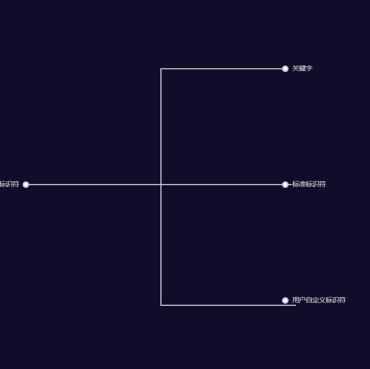

# 第一章：基础语法与数据类型
## 一、我对这章的理解
  这部分是C语言的地基，是专升本考试的送分题，但细节很多，这里捡一些我认为重要的东西。

## 二、重点知识点拆解
- c语言是如何从代码->可执行程序的呢？这里指c语言的编译
  - ```c
        #include <stdio.h>
          int main() {
            printf("Hello World!\n");
          return 0;
        }
  
  - 这个程序在计算机中经过编辑、编译、链接，最终显示在控制台上，具体如下：
    
    - 我们一行一行写代码的过程，我们称为**编辑**。而编辑完的程序在计算机中称为**源程序**是以 **文件名.c**的形式存储。
    - 在编辑完后运行，计算机会将代码转为二进制文件，这个**过程**我们称为**编译**,而后我们得到的文件称为**目标程序**以 **文件名.obj**的形式。
    - 之后计算机将二进制文件转为可执行文件的过程我们成为**链接**,而后我们得到的文件称为**可执行文件**以 **文件名.exe**的形式。

    #注：链接会引用其他文件，由于专升本很少做这方面的考察，不在此赘述。
    
- c语言的构成
  c语言是由若干函数组成。**函数**是c程序的基本单位
  - 有且只有**一个主函数main()**。主函数是一个程序的入口，也是一个程序的出口。
    - 当我们在做读代码题的时候，从main函数入手是一个不错的选择
  - 函数可以是预定义的便标准函数，如scanf函数，printf函数等
  - 大多数函数是由程序员根据实际问题定义的，函数间是**平行**的关系，因此c语言被称为函数式语言

- 语句
  - **语句**是组成程序的最小单位
  - c语言本身没有输入输出语句，scanf，printf是引用stdio.h文件的结果
  - 语句后必须要以**分号**结束
  - 只有分号的叫空语句，也可以被编译执行

- 其他
  - 预处理命令
    c语言中以'#'开头的语句,在程序开头
  - 注释
    //：单行注释
    /* 语句 */：多行注释

  - 基本语法成分
    - 字符集
      字符是可以区分的最小符号，构成程序的原始基础
    - 标识符
      - 标识符如图：
        
        
      
        - 关键字：void float 等等（C 语言系统预先定义、有固定语法含义，不能被用户使用做变量名、函数名。）
        - 标准标识符: printf、scanf等（系统 / 标准库预先定义好的名字，有固定含义，可以使用但不建议重定义覆盖。）
        - 用户自定义标识符：顾名思义，是用户自定义的标识符例如 a num等等（程序员自己起名的标识符，用来命名变量、函数、数组、结构体等。）

      - 这里讲一些标识符的命名规则，是重点
        **1.以数字 字母 下划线构成
        2.数字不能开头
        3.严格区分大小写
        4.不能使用 C 语言关键字**

        **标识符命名规则是重点**，这个知识点极其简单，是必得分点

  - 运算符
    运算符分为：
    1.单目运算符
    2.双目运算符
    3.三目运算符

    顾名思义，结合左右两侧操作数个数不同，分为以上三种
    
## 三、数据类型
  - 基本数据类型
    - int 整型
    - char 字符型
    - 实型
      实型又分为单精度浮点型和双精度浮点型
      - float 单精度浮点型
      - double 双精度浮点型
    - 空类型
  - 构造数据类型
    - 数组类型([])
    - 结构体类型(struct)
    - 共用体类型(union)
  - 指针类型
    - int*
    此处不多举例，后续指针章节会详解
  - 空类型

  
 
## 四、常量与变量
  - 常量
    1.整型常量
    
      - 十进制整数
      - 八进制整数
      - 十六进制整数
    2.实型常量

      - 十进制数形式
      - 指数形式
        - 此处指数形式有一个判断口诀供大家参考**e前e后都有数，e后是整数。E/e均可**
      
      例：
    
        以下写法正确的是()
    
        A.017
    
        B.3e-1.0
    
        C.OX29
    
        D.1e+2
    
      3.字符常量  
        由单引号括起来的**单个普通字符**或**转义字符**  
        字符常量的值：该字符的ASCII码值  
        转义字符：反斜线后面跟一个字符或一个代码的值表示  
        - 此处ASCII码值我们要记住一些常用的：  
           'A'-65  'a'-97  
           'B'-66  'b'-98  
           '0'-48  '1'-49  
          同时我们观察到，每个英文字母对应的大写ASCII码值减去小写ASCII码值都是32,所以我们可以用加减32来实现大小写的转换  
        - 转义字符：  
          \n：换行    
          \t：水平制表    
          \000:三位八进制代表的字符      
        - 转义字符在考试中考频不高，我们目前不做赘述  
    4.字符串常量
      由一对双引号定界，并由0个或若干字符租场。可以含有空格，还可以含有转义字符。两个双引号可以没有内容，而没有内容的字符串成为“空串”。

      - 在字符串存储中：每个字符串结尾自动加一个'\0'作为字符串结束标志
      - 字符串存储大小=字符个数+1（'\0'）

    5.符号常量（宏定义）
      用#define宏定义。指用一个符号名称代替一个常量  
      如：   #defing PI 3.1415   //注意：此处结尾无分号
      在后续引用可以直接使用PI代替3.1415
    
    
    
        
