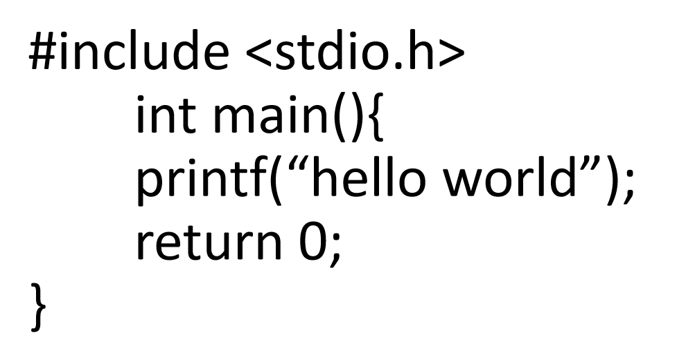
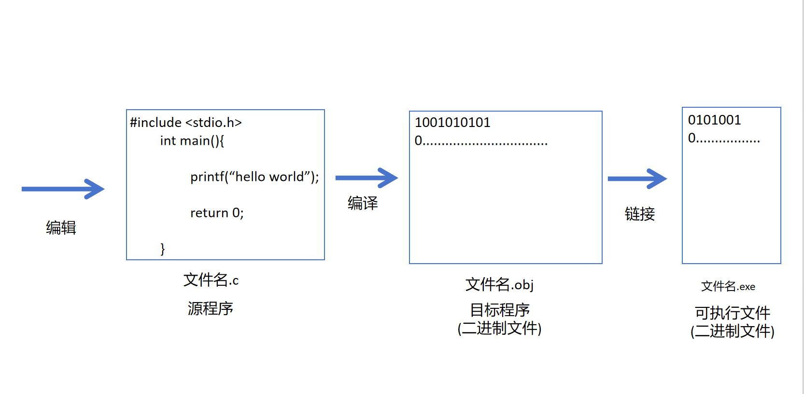

# 第一章：基础语法与数据类型
## 一、我对这章的理解
  这部分是C语言的地基，是专升本考试的送分题，但细节很多，这里捡一些我认为重要的东西。

## 二、重点知识点拆解
- c语言是如何从代码->可执行程序的呢？这里指c语言的编译
  - 
  - 这个程序在计算机中经过编辑、编译、链接，最终显示在控制台上，具体如下：
    
    - 我们一行一行写代码的过程，我们称为**编辑**。而编辑完的程序在计算机中称为**源程序**是以 **文件名.c**的形式存储。
    - 在编辑完后运行，计算机会将代码转为二进制文件，这个**过程**我们称为**编译**,而后我们得到的文件称为**目标程序**以 **文件名.obj**的形式。
    - 之后计算机将二进制文件转为可执行文件的过程我们成为**链接**,而后我们得到的文件称为**可执行文件**以 **文件名.exe**的形式。

    #注：链接会引用其他文件，由于专升本很少做这方面的考察，不在此赘述。
    
- c语言的构成
  c语言是由若干函数组成。**函数**是c程序的基本单位
  - 有且只有**一个主函数main()**。主函数是一个程序的入口，也是一个程序的出口。
    - 当我们在做读代码题的时候，从main函数入手是一个不错的选择
  - 函数可以是预定义的便标准函数，如scanf函数，printf函数等
  - 大多数函数是由程序员根据实际问题定义的，函数间是**平行**的关系，因此c语言被称为函数式语言

- 语句
  - **语句**是组成程序的最小单位
  - c语言本身没有输入输出语句，scanf，printf是引用stdio.h文件的结果
  - 语句后必须要以**分号**结束
  - 只有分号的叫空语句，也可以被编译执行

- 其他
  - 预处理命令
    c语言中以'#'开头的语句,在程序开头
  - 注释
    //：单行注释
    /* 语句 */：多行注释

  - 基本语法成分
    - 字符集
      字符是可以区分的最小符号，构成程序的原始基础
    - 标识符
      - 标识符如图：
        
      ![标识符](images/C_Identifier.png
      
        - 关键字：void float 等等（C 语言系统预先定义、有固定语法含义，不能被用户使用做变量名、函数名。）
        - 标准标识符: printf、scanf等（系统 / 标准库预先定义好的名字，有固定含义，可以使用但不建议重定义覆盖。）
        - 用户自定义标识符：顾名思义，是用户自定义的标识符例如 a num等等（程序员自己起名的标识符，用来命名变量、函数、数组、结构体等。）
        
## 三、我踩过的坑&易错点

## 四、配套代码示例
